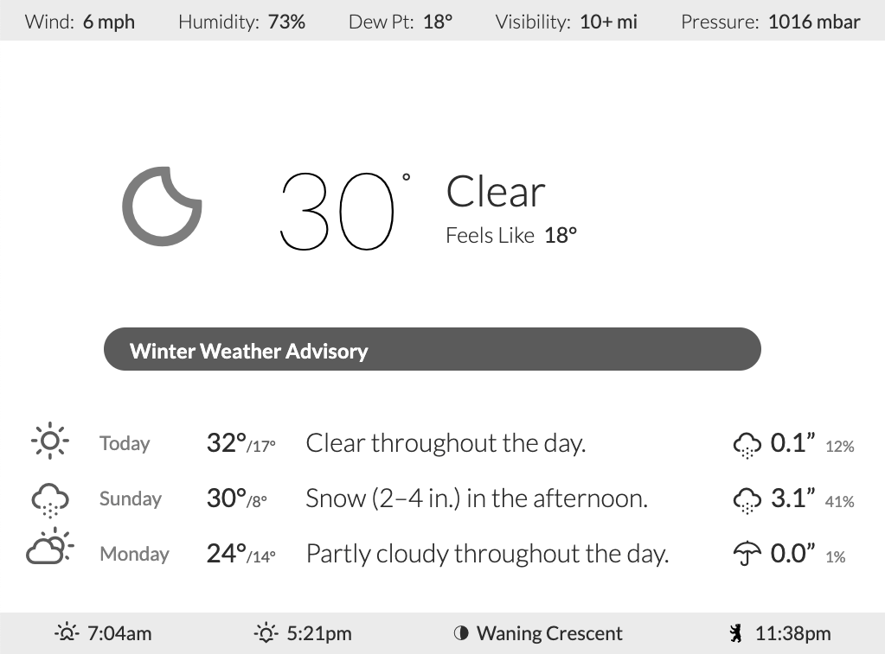

# weather-joan
_Display the current weather on a Joan e-ink device_




I wanted to display the current data from my home weather station along with the upcoming forecast on a little display by my door. I've always liked the look and function of Visionect's Joan devices for managing conference room schedules, and started to wonder if there was a way to use one for my display.

I came across a [blog post on Joan's site](https://getjoan.com/blog/diy-home-automation-system/) about repurposing the devices for a home automation control panel, which confirmed that it was possible, but without really sharing any of the key details.

Here's how to do it:


## What you'll need

There are a couple of hardware components you'll need to get this working:
  
  1. A Joan device: I ordered a Joan Home [directly from Visionect](https://getjoan.com/shop/) for $250 and it arrived in the US from Slovenia in just about a week.
  2. A basic computer running Linux: I'm using a Raspberry Pi 4 that I got in a kit from [Vilros](https://vilros.com/collections/raspberry-pi-kits) for about $120.
  3. Optionally a network-connected home weather station: I have a [Netatmo system](https://shop.netatmo.com/en-us/weather/smart-weather-station/weatherstation) that's about $180.
  
From there, it's mostly software installation and setup.

## Getting started

### docker

Most of the software that's needed here is most easily installed and run via Docker. For my Raspberry Pi, I followed [these instructions](https://phoenixnap.com/kb/docker-on-raspberry-pi):

```bash
# update local OK
sudo apt-get update && sudo apt-get upgrade


# download docker installation script
curl -fsSL https://get.docker.com -o get-docker.sh

# execute installation script
sudo sh get-docker.sh

# add the `pi` user to the `docker` posix group to be able to run containers without privilege escalation
sudo usermod -aG docker pi

# check version to see if you're all installed
docker version
```

### docker-compose

The `docker-compose` tool makes it a lot easier to keep track of key settings for your docker containers. I definitely recommend installing it. I followed the [official docs](https://docs.docker.com/compose/install/):

```bash
# download and save the tool
sudo curl -L "https://github.com/docker/compose/releases/download/1.28.2/docker-compose-$(uname -s)-$(uname -m)" -o /usr/local/bin/docker-compose

# add executable permissions
sudo chmod +x /usr/local/bin/docker-compose

# link into your $PATH
sudo ln -s /usr/local/bin/docker-compose /usr/bin/docker-compose

# test the installation
docker-compose --version
```


### Home Assistant

I'd never used [Home Assistant](https://www.home-assistant.io) before, and have been really impressed by just how well it works and how polished it feels. It required no fussing around to get working, and the GUI is really intuitive and easy to use.


I followed the [official installation guide](https://www.home-assistant.io/docs/installation/docker/) and my `docker-compose.yml` is almost identical to the one in the doc and is only updated to reflect the correct base image for the Raspberry Pi 4:

```yaml
version: "3"
services:
  homeassistant:
    container_name: home-assistant
    image: homeassistant/raspberrypi4-homeassistant:stable
    volumes:
      - /PATH/TO/A/LOCAL/CONFIG/DIR:/config
    environment:
      - TZ=America/New_York
    restart: always
    network_mode: host
```

From there, use `docker-compose` to run the container:

```bash
docker-compose up -d
```

Once the container is running, the web GUI will be available on port 8123 of your server (`http://<local_ip_address>:8123`) and you can finish configuration there.

I added the following configurations to my installation:
 1. [Netatmo](https://www.home-assistant.io/integrations/netatmo/)
 2. [AccuWeather](https://www.home-assistant.io/integrations/accuweather/)
 3. [Dark Sky](https://www.home-assistant.io/integrations/darksky/) (was lucky enough to sign up for an API key while they were still giving them out!)
 
 You'll also need an API token/key to extract data from Home Assistant. In the Gui, go to your user profile, and scroll to the `Long-Lived Access Tokens` section at the bottom of the page. Create a token, and store the value in a safe place.
 
 ### Visionect Software Suite
 
 Joan devices are very thin clients that just display a rendered image, and depend on the [Visionect Software Studio](https://docs.visionect.com/VisionectSoftwareSuite/index.html) to do this rendering.
 
 I used the `docker-compose.yml` file [linked from the official docs](https://hub.docker.com/r/visionect/visionect-server-v3-armhf/) but made one addition. Since I was installing VSS on the same host as Home Assistant, I needed to be able to access the machine's network from inside the docker container. Ordinarily, using `network_mode: host` works for this, but the VSS container needs to run in its own vnet, so I added a hostname mapping to the `services.vserver3` section of the `docker-compose.yml` file:
 
 ```yaml
extra_hosts:
- "host.docker.internal:host-gateway"
```

The Docker docs suggest that `extra_hosts` is a kludgy and deprecated way of making this work, but that'll do for now!

Once VSS and its dependencies are running, go to the web GUI on port 8081 to set a new admin password. Then it's time to get the Joan device connected to it.

The [Joan Configurator](https://support.getjoan.com/hc/en-us/articles/360007080299-How-to-download-the-Joan-Configurator-) is a little wonky. I couldn't get the official package to install on my Mac, so I used the Windows version.

The wifi auto-detect tool didn't work, so I had to manually input my network SSID and password. From there, I opened the `Advanced Options` to specify:
- On-premises hosting
- The Raspberry Pi's local NATed IP address (I couldn't make a local hostname work, and manually inputting network settings means you can't use DHCP auto-config)

Once configured, the device registers itself with VSS, and you can push some content to it!

### AppDaemon

The Joan blog post suggests using HADashboard (now [AppDaemon](https://appdaemon.readthedocs.io/en/latest/)) as the UI for your display. I was able to get it running in a Docker container following the [official guide](https://appdaemon.readthedocs.io/en/latest/) (had to add `network_mode: host` to connect to the Home Assistant container running on the same host), but I ultimately decided it was the wrong tool for the job.

I wanted a really pretty read-only display, and AppDaemon is designed more for functional and interactive controllers to turn smart devices on and off and toggle smart home settings. You can customize the CSS, but the foundations in place there are really opinionated, and it's hard to achieve any sort of pixel-perfect result.

After fighting the constraints of AppDaemon's Dashboards, Widgets, and Skins, I decided I was going to have an easier time integrating it all in a web page.

### nginx

To serve my web page, I installed nginx directly on my Raspberry Pi -- I probably could have dug around for a docker image, but I knew this would _just work_:

```bash
sudo apt-get install nginx
```

From there, I set up a site config in `/etc/nginx/sites-available/joan`:

```
server {
  listen 8082;
  root /path/to/some/local/dir/with/html;

  location /api {
    proxy_pass http://localhost:8123;
  }
}
```

Symlink the config into `sites-enabled`:

```bash
sudo ln -s /etc/nginx/sites-available/joan /etc/nginx/sites-enabled/joan
```

...and then reload nginx's config:

```bash
sudo service nginx reload
```

Since we need to connect to the Home Assistant API (running locally on port 8123) from the web page, I got around CORS limitations by having nginx proxy calls to `/api`. There might be a more elegant way, but I know nginx better than I know CORS!

## Building the UI

VSS runs a somewhat limited or at least idiosyncratic headless version of WebKit to render web pages into the images that are displayed on Joan devices. All I know is that some things worked and some things didn't, so I had to find workarounds when the page would load correctly in a full version of Chrome but not render in VSS.

Two key components there:
1. An HTTP client since I can't stand dealing with the XHR API directly (I used [axios](https://www.npmjs.com/package/axios) but jQuery or anything else that can make an AJAX request will work)
2. A framework for DOM binding (I used [Knockout](https://knockoutjs.com/) because it's so easy to integrate for a single read-only view like this one, but VueJS or React or anything else could do the job)

I also used a couple of tools to aid in data presentation and styling:
- [Moment Timezone](https://momentjs.com/timezone/) for managing timezone conversion and datetime formatting
- Erik Flowers' gorgeous [Weather Icons](https://erikflowers.github.io/weather-icons/) font
- Some open-source Google webfonts parsed for local installation with [google-webfonts-helper](https://google-webfonts-helper.herokuapp.com/fonts/)

I installed all the client-side libraries locally instead of using something like CDNJS. The above-ground cable lines near me are damaged frequently enough by falling braanches/trees that I wanted everything to work locally, even if it's with stale data.

I haven't included my actual UI here, but I've sketched out the key logic in [index.html](index.html).

For a lot of weather metrics, Home Assistant's API pre-maps relevant [Material Design Icons]() but I preferred the look of Weather Icons, which also includes a handy [mapping reference](https://erikflowers.github.io/weather-icons/api-list.html) for a couple popular weather APIs.

I got a lot of inspiration for my UI design from Dark Sky and AccuWeather :-)

Worth noting that the [Joan 6" display](https://support.getjoan.com/hc/en-us/articles/360006718799-Joan-6-Technical-specifications) is 1024x758 and displays 16 levels of gray, so use your font weights and tones judiciously!


## Putting it all together

Once you've got the UI looking good and working well in a plain old browser, connect it to your Joan through VSS. From the `Status` or `Devices` tab in the nav, find your device, and specify the web page content. In my case, that meant pointing it to `http://host.docker.internal:8082/ui.html`. I specified a 5-minute refresh interval, and adjusted the screen rotation to suit my mounting location.

## Questions?

If you have questions, submit them via the repo's [issue tracker](https://github.com/schwartzie/weather-joan/issues) and I'll do my best to answer!

